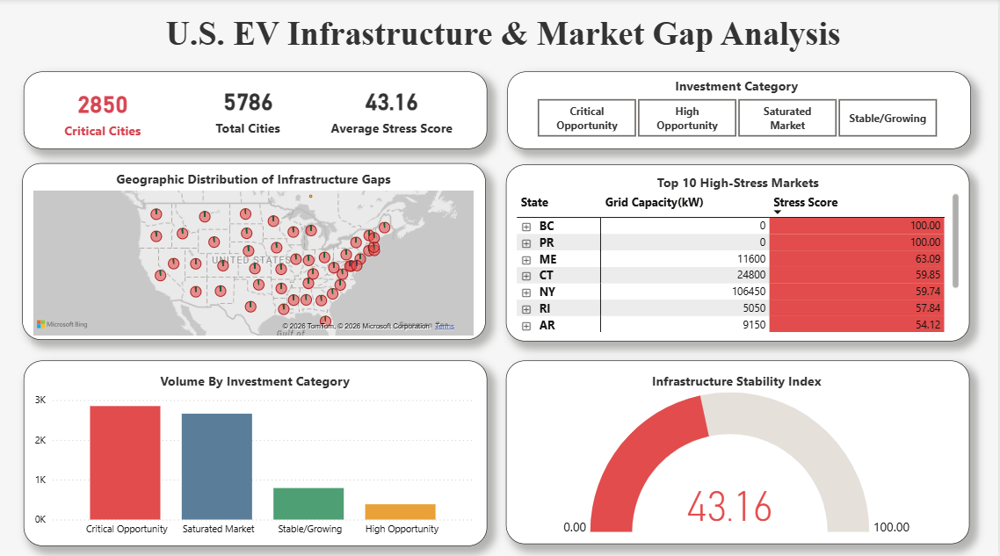

# 🚗⚡ EV Infrastructure Stress Analysis (End-to-End Data Project)

## 📸 Power BI Dashboard

---

## 📌 Business Question

**Which U.S. cities are most profitable for new EV fast-charging investments in 2026?**

As electric vehicle battery sizes grow faster than charging infrastructure, some cities face high charging stress.
This project identifies high-opportunity cities using an end-to-end analytics pipeline.

---

## 🧠 Project Overview

This project follows a real-world analytics workflow used in business teams, combining:

- Government infrastructure data (Supply)

- Vehicle technical specifications (Demand)

- Business-focused metrics (Stress Score)

- Executive-ready dashboard (Power BI)

**Core Insight:** 
Big batteries + slow chargers = infrastructure stress = investment opportunity

---

## 🛠️ Tools & Technologies

- **Excel / Power Query**  – Data cleaning & auditing

- **PostgreSQL (SQL)** – Data modeling & aggregation

- **Python (Pandas, NumPy)** – Feature engineering & stress scoring

- **Power BI** – Interactive executive dashboard

---

## 📊 Datasets Used

**1️. Alternative Fueling Stations (Supply)**

- EV charging station locations

- Charger types (Level 2, DC Fast)

- Network providers (Tesla, ChargePoint, etc.)

- Status & operational dates

**2️. Light-Duty Vehicle Specifications (Demand)**

- Battery capacity (kWh)

- DC fast charging rate (kW)

- Electric-only range

- Model year (filtered for 2022+)

---

## 🔄Project Workflow

- **Phase 1:**  Excel – Data Cleaning & Trust

**Goal:** Ensure data quality before analysis

**Actions:** Removed 70+ irrelevant columns

**Filtered:**

- Fuel Type = Electric

- Station Status = Active

- Vehicle Model Year ≥ 2022

- Fixed ZIP codes (geospatial accuracy)

- Audited null values & duplicates

---

- **Phase 2:**  SQL – Data Modeling & Aggregation

**Goal:** Create business-ready datasets

**Tables:**

- fact_stations → EV charging supply

- dim_vehicles → EV demand

**Key SQL outputs:**

- City-level charging power

- Average battery demand

**Example logic:**

**Assigned power weights to chargers:**

- DC Fast charger = 50kW
- Level 2 charger = 7kW to calculate total city-wide capacity.

---

- **Phase 3:** Python – Feature Engineering

**Goal:**  Create a metric that doesn’t exist in raw data

**Pipeline:** Implemented a direct PostgreSQL-to-Python pipeline using SQLAlchemy to automate real-time data retrieval

**🔑 Stress Score Formula:** 

$$Stress\ Score = \frac{Average\ Battery\ Capacity\ (kWh)}{Total\ DC\ Fast\ Power\ (kW)}$$

**Logic highlights:**

- Cities with 0 DC fast chargers → Critical opportunity

- Scores clipped to avoid outliers

**Cities classified into:**

- Critical Opportunity

- High Opportunity

- Stable / Growing

- Saturated Market

---

- **Phase 4:** Power BI – Executive Dashboard

**Goal:** Turn analysis into decisions

**Dashboard Features:**

- Investment Map (Stress Score by city)

- Top 10 High-Stress Cities

- KPIs

- Total Cities

- Critical Opportunity Cities

- Average Stress Score

- Interactive Slicer (Investment Category)

- Category comparison charts

---

## 📁 Project Structure

**EV-Infrastructure-Analysis**

**1_Data_Source**  - All data was sourced from the U.S. Department of Energy - Alternative Fuels Data Center (AFDC).

- [Alternative Fueling Stations](https://afdc.energy.gov/data_download) — Used to identify DC Fast and Level 2 charging supply by city.

- [Light-Duty Vehicle Specifications](https://afdc.energy.gov/data_download) — Used to extract battery capacities (kWh) and charging speeds for demand modeling.

**Note:** Due to the large file size of the U.S. government datasets (over 100MB), only the cleaned and aggregated subsets are hosted in this repository.

- [cleaned_data](./1_Data_Source/cleaned_data/)-Contains the processed CSV and Excel files ready for analysis.

**2_SQL_Scripts**
- [1_testing](./2_SQL_Scripts/1_testing.sql) - Data integrity and validation queries.
- [2_city-level_supply_aggregation](./2_SQL_Scripts/2_city-level_supply_aggregation.sql) - Aggregating charging station data.
- [3_vehicle_demand_aggregation](./2_SQL_Scripts/3_vehicle_demand_aggregation.sql) - Processing vehicle specs for demand modeling.

**3_Python_Analysis**
- [ev_investment_analysis](./3_Python_Analysis/ev_investment_analysis.ipynb) - SQL-to-Python sync and Stress Score feature engineering.

**4_Dashboard**
- [ev_infrastructure_dashboard](./4_Dashboard/ev_infrastructure_dashboard.pbix) - Final interactive Power BI file.

**Image**
- [ev_infrastructure_dashboard](./Image/ev_infrastructure_analysis_dashboard.png) - High-res screenshot for the README preview.

---

## 📌 Key Business Insights

- Several cities show high EV demand but weak fast-charging supply

- DC fast charging gaps signal strong ROI opportunities

- Infrastructure growth is not evenly distributed

---

## 🔮 Future Scope

- Incorporating EV adoption growth forecasts by city
  
- Adding real-time charger utilization and downtime data
  
- Including pricing and installation cost to estimate ROI

---

## ✅ Conclusion

This project demonstrates how data analytics can identify real-world infrastructure gaps by combining supply, demand, and business logic. It showcases a complete analytics pipeline that turns raw data into actionable investment insights.

