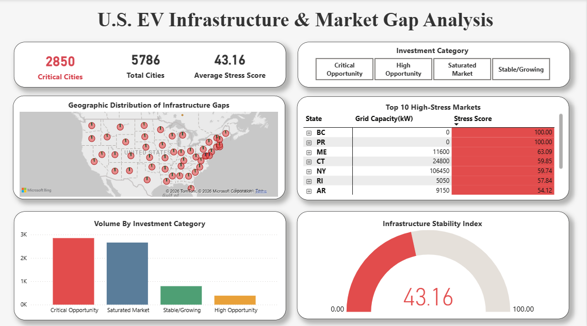

# 🚗⚡EV Infrastructure Stress Analysis | Python, SQL, Power BI, Excel
## 📸 Power BI Dashboard

---

## 📌 Business Question

**Which U.S. cities have the highest EV charging demand-supply gap, and where should companies invest in fast-charging infrastructure for maximum ROI?**

As electric vehicle battery sizes grow faster than charging infrastructure, some cities face high charging stress.
This project identifies high-opportunity cities using an end-to-end analytics pipeline.

---

## 🧠 Project Overview

This project simulates a real-world analytics workflow, combining:

- Government infrastructure data (Supply)

- Vehicle technical specifications (Demand)

- Business-focused metrics (Stress Score)

- Interactive dashboard (Power BI)

**Core Insight:** 
Cities with high battery demand but limited fast-charging infrastructure represent the strongest investment opportunities due to unmet charging needs.

---

## 🛠️ Tools & Technologies

- **Excel / Power Query**  – Data cleaning & auditing

- **PostgreSQL (SQL)** – Data modeling & aggregation

- **Python (Pandas, NumPy)** – Feature engineering & stress scoring

- **Power BI** – Interactive dashboard

---

## 📊 Datasets Used

**1️. Alternative Fueling Stations (Supply)**

- EV charging station locations

- Charger types (Level 2, DC Fast)

- Network providers (Tesla, ChargePoint, etc.)

- Status & operational dates

**2️. Light-Duty Vehicle Specifications (Demand)**

- Battery capacity (kWh)

- DC fast charging rate (kW)

- Electric-only range

- Model year (filtered for 2022+)

---

## 🔄Project Workflow

- **Phase 1:**  Excel – Data Cleaning & Trust

**Goal:** Ensure data quality before analysis

**Actions:** Removed 70+ irrelevant columns

**Filtered:**

- Fuel Type = Electric

- Station Status = Active

- Vehicle Model Year ≥ 2022

- Fixed ZIP codes (geospatial accuracy)

- Audited null values & duplicates

---

- **Phase 2:**  SQL – Data Modeling & Aggregation

**Goal:** Create business-ready datasets

**Tables:**

- fact_stations → EV charging supply

- dim_vehicles → EV demand

**Key SQL outputs:**

- City-level charging power

- Average battery demand

**Example logic:**

**Assigned power weights to chargers:**

- DC Fast charger = 50kW
- Level 2 charger = 7kW to calculate total city-wide capacity.

---

- **Phase 3:** Python – Feature Engineering

**Goal:**  reate a business metric to quantify infrastructure stress and identify high-opportunity investment zones.

**Pipeline:** Built a PostgreSQL-to-Python pipeline using SQLAlchemy to automate data retrieval and feature engineering.

**🔑 Stress Score Formula:** 

$$Stress\ Score = \frac{Average\ Battery\ Capacity\ (kWh)}{Total\ DC\ Fast\ Power\ (kW)}$$

**Logic highlights:**

- Higher score → Higher demand, lower infrastructure supply
- Cities with zero DC fast chargers identified as critical investment zones
- Categorized cities into opportunity segments for business prioritization

**Cities classified into:**

- Critical Opportunity

- High Opportunity

- Stable / Growing

- Saturated Market

---

- **Phase 4:** Power BI – Executive Dashboard

**Goal:** Visualize insights through an interactive Power BI dashboard

**Dashboard Features:**

- Investment Map (Stress Score by city)

- Top 10 High-Stress Cities

- KPIs

- Total Cities

- Critical Opportunity Cities

- Average Stress Score

- Interactive Slicer (Investment Category)

- Category comparison charts

---

## 📁 Project Structure

**EV-Infrastructure-Analysis**

**1_Data_Source**  - All data was sourced from the U.S. Department of Energy - Alternative Fuels Data Center (AFDC).

- [Alternative Fueling Stations](https://afdc.energy.gov/data_download) — Used to identify DC Fast and Level 2 charging supply by city.

- [Light-Duty Vehicle Specifications](https://afdc.energy.gov/data_download) — Used to extract battery capacities (kWh) and charging speeds for demand modeling.

**Note:** Due to the large file size of the U.S. government datasets (over 100MB), only the cleaned and aggregated subsets are hosted in this repository.

- [cleaned_data](./1_Data_Source/cleaned_data/)-Contains the processed CSV and Excel files ready for analysis.

**2_SQL_Scripts**
- [1_testing](./2_SQL_Scripts/1_testing.sql) - Data integrity and validation queries.
- [2_city-level_supply_aggregation](./2_SQL_Scripts/2_city-level_supply_aggregation.sql) - Aggregating charging station data.
- [3_vehicle_demand_aggregation](./2_SQL_Scripts/3_vehicle_demand_aggregation.sql) - Processing vehicle specs for demand modeling.

**3_Python_Analysis**
- [ev_investment_analysis](./3_Python_Analysis/ev_investment_analysis.ipynb) - SQL-to-Python sync and Stress Score feature engineering.

**4_Dashboard**
- [ev_infrastructure_dashboard](./4_Dashboard/ev_infrastructure_dashboard.pbix) - Final interactive Power BI file.

**Image**
- [ev_infrastructure_dashboard](./Image/ev_infrastructure_analysis_dashboard.png) - High-res screenshot for the README preview.

---

## 📌 Key Business Insights

-Identified cities with high EV demand but insufficient fast-charging infrastructure, indicating strong investment potential

- Discovered that DC fast charger availability is the primary bottleneck in high-demand regions
  
- Highlighted cities with zero fast-charging infrastructure as critical expansion opportunities
  
- Found that infrastructure growth is uneven across regions, leading to localized charging stress

---

## ✅ Conclusion

This project demonstrates an end-to-end analytics workflow that transforms raw infrastructure and vehicle data into actionable investment insights. By introducing a custom Stress Score metric, it enables data-driven decision-making for EV infrastructure expansion and strategic planning.

